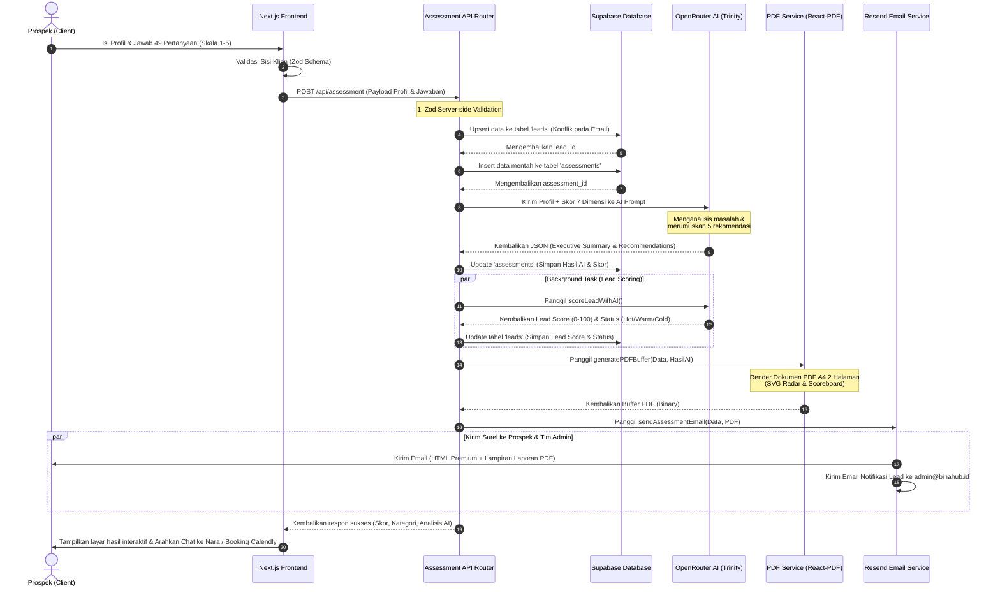

# Laporan Analisis Sistem: BinaHub Production Website
*Human Synergy & Strategic Transformation Platform*

---

## 1. Pendahuluan & Ringkasan Eksekutif

**BinaHub** (`website-prod`) dirancang sebagai platform B2B premium untuk **PT BinaHub (Human Synergy Partner)**. Platform ini bukan sekadar profil perusahaan statis, melainkan sebuah **mesin konversi leads otomatis** (*Automated Lead Generation Funnel*) yang dirancang untuk memetakan kematangan operasional dan efisiensi sumber daya manusia (SDM) perusahaan klien. 

Pintu gerbang utama dari platform ini adalah **BinaHub Insight Diagnostic**, sebuah sistem penilaian mandiri (*self-assessment*) interaktif yang mengevaluasi performa organisasi berdasarkan **7 Dimensi Inti BinaHub**:
1. **Insights** (Kemampuan manajemen berbasis data dan KPI).
2. **Lab** (Kompetensi, kolaborasi, dan pemecahan masalah tim).
3. **Coach** (Peran pemimpin sebagai pembimbing dan budaya umpan balik).
4. **Play** (Energi, antusiasme, motivasi, dan kebahagiaan lingkungan kerja).
5. **Academy** (Program pengembangan dan kurikulum berkelanjutan).
6. **Works** (Kejelasan peran, standardisasi proses, dan ketercapaian target).
7. **Impact** (Pengukuran ROI investasi pengembangan SDM).

Dengan menggabungkan desain antarmuka mewah berskala korporat (bertema warna *Navy* dan *Gold*), animasi mikro yang responsif, kecerdasan buatan (*AI reasoning*), pembuatan dokumen dinamis, dan integrasi surel otomatis, platform ini berhasil memberikan pengalaman pengguna kelas atas yang sangat meyakinkan bagi klien korporat.

---

## 2. Alur Kerja Sistem Terintegrasi (System Workflow)

Sistem BinaHub mengimplementasikan alur konversi tertutup (*closed-loop funnel*) yang sangat rapi. Berikut adalah detail langkah-langkah alur kerja dari sisi pengguna (*frontend*) hingga pengolahan data di sisi peladen (*backend*):

### A. Alur Akuisisi & Interaksi Awal (Acquisition Flow)
1. **Intro Animasi Premium**: Saat pertama kali mendarat di situs, pengguna disuguhkan dengan [IntroAnimation](file:///c:/Users/USER/OneDrive/Documents/Dokumen%20Binahub/website-prod/src/components/intro-animation.tsx) berupa gerakan animasi logo yang estetik, memberikan kesan platform premium sebelum memuat konten utama.
2. **Landing Page Eksploratif**: Pengguna diarahkan ke halaman utama yang terbagi atas beberapa bagian dinamis seperti [HeroSection](file:///c:/Users/USER/OneDrive/Documents/Dokumen%20Binahub/website-prod/src/app/_sections/hero-section.tsx), [ServicesSection](file:///c:/Users/USER/OneDrive/Documents/Dokumen%20Binahub/website-prod/src/app/_sections/services-section.tsx) yang menggunakan visual interaktif [StackingServiceCards](file:///c:/Users/USER/OneDrive/Documents/Dokumen%20Binahub/website-prod/src/components/stacking-service-cards.tsx), dan [WorkflowSection](file:///c:/Users/USER/OneDrive/Documents/Dokumen%20Binahub/website-prod/src/app/_sections/workflow-section.tsx).
3. **Conversational Concierge (Nara)**: Di pojok kanan bawah terdapat [ChatBot](file:///c:/Users/USER/OneDrive/Documents/Dokumen%20Binahub/website-prod/src/components/chat-bot.tsx) bernama **Nara**, asisten *concierge* berbasis AI yang hangat dan solutif. Nara bertugas menjawab pertanyaan seputar 7 layanan BinaHub, mendengarkan tantangan bisnis secara empatik, dan secara proaktif mengarahkan pengguna untuk mengambil diagnostik gratis di `/insight` demi pemetaan solusi yang akurat. Jika pengguna menyebutkan profil mereka di chat, sistem Nara dapat otomatis mengekstrak dan menyimpannya sebagai *leads* (`save_chat_lead`).

---

### B. Alur Diagnostik & Pengolahan Data (Diagnostic Assessment Flow)

Proses inti konversi B2B berlangsung ketika pengguna mengakses halaman **BinaHub Insight Assessment**:



#### Rincian Langkah Operasional:
1. **Pengisian Kuesioner**: Prospek mengisi data profil (Nama, Email, Perusahaan, Jumlah Karyawan, Peran, WhatsApp, Tantangan Utama, Target) dan menjawab **49 pertanyaan diagnostik** (7 pertanyaan per dimensi dengan skala Likert 1-5).
2. **Validasi Zod & Payload**: Data dikirimkan ke `/api/assessment/route.ts` dan divalidasi secara ketat menggunakan [AssessmentSchema](file:///c:/Users/USER/OneDrive/Documents/Dokumen%20Binahub/website-prod/src/lib/validations.ts) untuk menjamin integritas data sebelum menyentuh lapisan database.
3. **Penyimpanan Database (Supabase)**:
   - **Tabel `leads`**: Sistem melakukan `upsert` pada profil kontak. Jika alamat email sudah terdaftar, data profil diperbarui secara otomatis. Ini menghindari duplikasi prospek.
   - **Tabel `assessments`**: Jawaban mentah beserta tautan ke `lead_id` disimpan ke tabel ini.
4. **Analisis AI Instan (OpenRouter)**:
   - Nilai dari 49 pertanyaan dikelompokkan per dimensi dan dikalkulasi menjadi skala persentase (0-100%).
   - Profil dan skor dimensi dikirimkan ke [ai-service.ts](file:///c:/Users/USER/OneDrive/Documents/Dokumen%20Binahub/website-prod/src/lib/ai-service.ts) menggunakan model *reasoning* tingkat tinggi (**`arcee-ai/trinity-large-thinking:free`**).
   - AI bertindak sebagai "Tim Konsultan Senior BinaHub" yang menganalisis kendala utama prospek, menyusun kesimpulan eksekutif yang sangat tajam dalam 3-4 kalimat Bahasa Indonesia, dan memetakan **5 rekomendasi taktis** yang relevan dengan pilar ekosistem BinaHub.
5. **Background Lead Scoring**:
   - Secara asinkron (*non-blocking*), AI menilai kualitas prospek tersebut (Skor 0-100) dan mengategorikannya ke dalam status `hot`, `warm`, atau `cold` berdasarkan tantangan dan skala perusahaan mereka, kemudian memperbarui profil mereka di tabel `leads`.
6. **Pembuatan Dokumen PDF Dinamis**:
   - Backend memanggil [pdf-service.tsx](file:///c:/Users/USER/OneDrive/Documents/Dokumen%20Binahub/website-prod/src/lib/pdf-service.tsx).
   - Menggunakan `@react-pdf/renderer`, sistem merender dokumen PDF ukuran A4 sebanyak 2 halaman dengan gaya profesional:
     - **Halaman 1**: Informasi profil, skor total, indikator klasifikasi *Confidential*, visualisasi grafik **SVG Radar Chart** (peta 7 dimensi), visualisasi **Performance Scoreboard** (grafik batang horizontal), dan *Executive Summary* dari AI.
     - **Halaman 2**: Detail 5 kartu rekomendasi prioritas dari AI, serta taklimat khusus dari tim konsultan berdasarkan dimensi dengan skor terendah.
7. **Pengiriman Surel & Distribusi Laporan (Resend)**:
   - Email dikirimkan menggunakan [email-service.ts](file:///c:/Users/USER/OneDrive/Documents/Dokumen%20Binahub/website-prod/src/lib/email-service.ts) melalui API **Resend**.
   - **Surel Prospek**: Berupa surel HTML premium bergaya korporat yang memuat skor indeks, ringkasan analisis, sorotan 3 prioritas teratas, tautan penjadwalan konsultasi melalui Calendly, dan melampirkan berkas PDF Laporan Diagnostik yang baru saja dibuat.
   - **Surel Admin**: Tim internal BinaHub (`admin@binahub.id`) mendapatkan notifikasi instan berupa rincian data prospek baru untuk segera ditindaklanjuti secara manual.

---

## 3. Spesifikasi Arsitektur Teknologi (Technology Stack)

Website BinaHub dirancang menggunakan kombinasi teknologi modern, aman, dan efisien:

| Lapisan (Layer) | Teknologi | Peran / Deskripsi |
| :--- | :--- | :--- |
| **Framework Inti** | Next.js 16.2.6 (React 19.2.4) | Platform hibrida full-stack modern. Memanfaatkan *App Router* untuk routing halaman yang dinamis dan *API Routes* sebagai backend terpadu. |
| **Bahasa Pemrograman**| TypeScript 5 | Menjamin keamanan tipe data (*type safety*), mengurangi bug saat runtime, dan mendokumentasikan skema data secara langsung. |
| **Sistem Desain & Styling** | Tailwind CSS v4 + PostCSS | Framework CSS utilitas terbaru untuk kustomisasi komponen visual berkecepatan tinggi dengan ukuran berkas produksi yang sangat minimal. |
| **Mesin Animasi** | Framer Motion | Memberikan transisi halaman, efek melayang (*hover*), animasi pemuatan "Pixel Runner", dan efek *stacking cards* yang sangat mulus dan interaktif. |
| **Basis Data & Storage** | Supabase (`@supabase/supabase-js`) | Database PostgreSQL terkelola yang responsif. Digunakan untuk melacak data prospek (`leads`) dan riwayat asesmen (`assessments`) secara real-time. |
| **Kecerdasan Buatan (AI)** | OpenRouter API (`arcee-ai/trinity-large-thinking`) | Sebagai mesin analisis taktis yang menginterpretasikan nilai asesmen menjadi laporan eksekutif dan rekomendasi kontekstual. |
| **Pembuat Laporan PDF** | `@react-pdf/renderer` | Merender komponen React menjadi berkas biner PDF (A4) secara langsung di sisi server tanpa memerlukan instalasi browser headless. |
| **Pengiriman Surel** | Resend Service (`resend`) | Layanan API transactional email berskala tinggi untuk mengirim surel HTML premium lengkap dengan lampiran PDF. |
| **Validasi & Keamanan** | Zod (`zod`) | Melakukan skema parsing data profil prospek dan chat input untuk menghindari serangan injeksi atau data rusak. |
| **Perangkat Ikon** | Lucide React | Library ikon vektor berbasis SVG yang ringan, konsisten, dan mudah disesuaikan. |

---

## 4. Analisis Alasan Pemilihan Stack (Architectural Rationale)

Pemilihan kombinasi teknologi di atas didasari oleh kebutuhan performa, efisiensi operasional, dan kepuasan pengalaman pengguna B2B:

1. **Next.js 16 & React 19 (Server-Side Capabilities)**: 
   Sistem penanganan API, pembuatan PDF, dan panggilan kecerdasan buatan harus dilakukan di sisi server (Server-Side) untuk menyembunyikan API key rahasia (seperti OpenRouter API Key dan Resend API Key) dari mata publik. API Routes di Next.js memungkinkannya tanpa membutuhkan setup server Node.js terpisah (Express), menghemat biaya sewa VPS dan merampingkan kode.
2. **Supabase (Relational PostgreSQL Power)**:
   Karena data prospek membutuhkan struktur relasional yang jelas (satu prospek/lead dapat melakukan asesmen beberapa kali), database PostgreSQL di Supabase adalah pilihan tepat dibandingkan database NoSQL. Fitur `upsert` bawaan Supabase mempermudah pengelolaan lead berdasarkan keunikan email.
3. **OpenRouter API (Flexibility & Cost Efficiency)**:
   Dengan menggunakan OpenRouter sebagai jembatan, BinaHub tidak terikat pada satu penyedia LLM (seperti OpenAI saja). BinaHub dapat secara dinamis berganti model (misalnya menggunakan model reasoning canggih gratis/berbiaya rendah seperti Trinity Large Thinking dari Arcee AI) untuk menghemat biaya operasional secara drastis sembari mempertahankan kualitas analisis bahasa Indonesia yang sangat alami dan tajam.
4. **React-PDF Sisi Server (Resource Efficiency)**:
   Biasanya, pembuatan PDF di server membutuhkan pustaka seperti Puppeteer yang menjalankan browser Chromium di latar belakang—yang mana memakan memori RAM sangat besar (bisa mencapai 500MB+ per instansi) dan lambat. `@react-pdf/renderer` menggambar PDF langsung dari kode React deklaratif secara instan dengan konsumsi memori kurang dari 20MB, membuatnya sangat kompatibel dengan serverless server seperti Vercel.
5. **Resend (Modern Transactional Email Engine)**:
   Resend menawarkan API modern yang sangat andal dan cepat dengan dokumentasi luar biasa bagi pengembang, serta penanganan lampiran file berbasis enkripsi Base64 yang sangat stabil jika dibandingkan dengan Nodemailer tradisional yang sering mengalami kendala otentikasi SMTP.
6. **Tailwind CSS v4 & Framer Motion (B2B Authority Aesthetic)**:
   Klien B2B dari instansi korporat besar menuntut kenyamanan visual yang mencerminkan profesionalisme tinggi. Tailwind v4 memberikan kontrol styling presisi tanpa hambatan performa, sementara Framer Motion memberikan transisi premium (seperti intro animasi dan tumpukan kartu layanan) yang membuat situs terasa hidup dan berwibawa.

---

## 5. Kelebihan Platform (Key Advantages)

* **Otomatisasi Penuh dari Ujung ke Ujung (Fully Automated B2B Funnel)**: Prospek mandiri mengisi kuisioner, dan dalam waktu kurang dari 10 detik mereka menerima laporan PDF kustom di kotak masuk surel mereka beserta ringkasan visual interaktif di layar. 
* **Personifikasi AI "Manusiawi" yang Kuat**: AI diinstruksikan secara ketat untuk tidak pernah menyebut dirinya sebagai AI atau sistem otomatis. Ia menulis dalam gaya bahasa konsultan senior yang ramah dan tajam dalam Bahasa Indonesia, meningkatkan kredibilitas PT BinaHub di mata klien.
* **Lead Scoring & Prioritasi Progresif**: Integrasi scoring AI secara senyap mengklasifikasikan lead (`hot`/`warm`/`cold`) ke database. Ini menghemat ratusan jam kerja tim sales dalam memilah perusahaan mana yang siap membeli layanan konsultasi BinaHub.
* **Visualisasi Laporan Tingkat Premium**: Berbeda dengan platform kuisioner gratisan (seperti Google Forms atau Typeform), BinaHub menghasilkan laporan PDF A4 formal dua halaman lengkap dengan **radar chart SVG** yang dinamis dan dipersonalisasi. Dokumen ini sangat layak untuk langsung dipresentasikan oleh prospek kepada direksi mereka.
* **Integrasi CRM Konversasional (Chatbot Nara)**: Hubungan antara Nara (chatbot) dan asesmen terjalin erat. Nara mendeteksi riwayat asesmen prospek melalui URL parameter (misal saat diarahkan kembali setelah mengisi asesmen) dan menyesuaikan gaya bicaranya untuk membahas hasil skor tersebut secara personal.

---

## 6. Kekurangan Platform & Rekomendasi Solusi Teknis

Meskipun arsitekturnya sudah sangat matang dan modern, terdapat beberapa area potensial yang dapat ditingkatkan demi ketahanan jangka panjang sistem produksi:

### ⚠️ Kekurangan 1: Risiko Latensi Tinggi pada API Assessment (Latency Bottleneck)
**Masalah**: Di dalam `/api/assessment/route.ts`, satu permintaan POST harus menyelesaikan urutan tugas berantai: menulis ke Supabase (2x) ➡️ memanggil OpenRouter AI (1x) ➡️ menulis Supabase hasil AI (1x) ➡️ merender PDF (1x) ➡️ mengirim surel lewat Resend (2x). Seluruh rantai ini berjalan secara sekuensial (sinkron) sebelum mengembalikan respon ke frontend. Hal ini memicu latensi tinggi (respons membutuhkan waktu **6 - 12 detik**), yang berisiko memicu *timeout* pada penyedia hosting serverless (seperti Vercel yang membatasi timeout fungsi serverless gratis di angka 10 detik).
* **Rekomendasi Solusi**: 
  1. Pecah proses menjadi asinkron dengan taktik **Job/Queue Pattern** atau memanfaatkan **Next.js `waitUntil`** (jika menggunakan Vercel) atau *edge background jobs*.
  2. Frontend hanya perlu menunggu proses input Supabase awal selesai (Langkah 1-3 yang membutuhkan < 1 detik) untuk menerima respon sukses.
  3. Proses analisis AI, rendering PDF, dan pengiriman email didelegasikan ke tugas latar belakang (*background worker*) atau fungsi serverless asinkron terpisah. Pengguna di frontend dapat diberikan animasi pemuatan yang menarik sementara laporan dikirimkan ke email mereka dalam 1 menit ke depan.

### ⚠️ Kekurangan 2: Ketergantungan Font Eksternal pada PDF (Dynamic Font Loading Risk)
**Masalah**: Lapisan [pdf-service.tsx](file:///c:/Users/USER/OneDrive/Documents/Dokumen%20Binahub/website-prod/src/lib/pdf-service.tsx) mendaftarkan font *Inter* dengan memanggil URL CDN Google Fonts secara dinamis (`https://fonts.gstatic.com/...`). Apabila koneksi internet peladen sedang terganggu, CDN Google Fonts mengalami kendala, atau diblokir oleh sistem firewall peladen, proses rendering PDF akan langsung gagal total dengan galat penundaan (*timeout error*).
* **Rekomendasi Solusi**:
  * Unduh berkas font `.ttf` untuk font *Inter* (berbagai ketebalan: 300, 400, 500, 600, 700) dan simpan secara fisik di dalam folder proyek lokal (misalnya di `/public/fonts/`).
  * Daftarkan font di dalam file `pdf-service.tsx` menggunakan path lokal relatif berbasis `process.cwd()` untuk memastikan pembuatan PDF tidak pernah bergantung pada koneksi internet eksternal ke CDN Google Fonts.
    ```typescript
    import path from 'path';
    Font.register({
      family: 'Inter',
      fonts: [
        { src: path.join(process.cwd(), 'public/fonts/Inter-Regular.ttf'), fontWeight: 400 },
        { src: path.join(process.cwd(), 'public/fonts/Inter-Bold.ttf'), fontWeight: 700 }
      ]
    });
    ```

### ⚠️ Kekurangan 3: Kerentanan Kegagalan AI Pihak Ketiga (AI Service Dependency)
**Masalah**: Platform ini sepenuhnya bergantung pada OpenRouter API untuk menghasilkan kesimpulan analisis eksekutif dan rekomendasi taktis. Jika kuota API habis, kunci API kedaluwarsa, atau penyedia OpenRouter mengalami gangguan teknis (*outage*), pengguna tidak hanya akan kehilangan analisis, namun endpoint API assessment dapat mengembalikan status galat 502/500 sehingga menghalangi prospek menyelesaikan pengisian kuisioner.
* **Rekomendasi Solusi**:
  * Sediakan **Skoring & Analisis Cadangan Lokal (Local Standby Fallback)**. Jika panggilan AI ke OpenRouter gagal (ditangkap oleh blok `try-catch`), sistem tidak boleh menyerah.
  * Buat algoritma berbasis aturan statis (*rule-based algorithm*) yang mengambil simpulan teks siap pakai berdasarkan skor dimensi terendah dari database lokal, misalnya: *"Perusahaan Anda menunjukkan performa unggul di pilar X, namun memerlukan perbaikan mendalam pada pilar Y..."*. Hal ini menjamin pengguna tetap menerima laporan PDF dan email secara instan meskipun kecerdasan buatan sedang tidak aktif.

### ⚠️ Kekurangan 4: Penimpaan Kontak Lead Berulang (Lead Profile Overwriting)
**Masalah**: Sistem menggunakan metode `upsert` pada tabel `leads` berdasarkan kunci unik alamat email. Jika prospek yang sama mengisi asesmen kedua kalinya dengan menuliskan nama perusahaan yang berbeda, atau memiliki jumlah karyawan baru, data profil lama mereka di CRM akan tertimpa sepenuhnya tanpa ada pencatatan riwayat historis perkembangan perusahaan mereka.
* **Rekomendasi Solusi**:
  * Biarkan tabel `leads` berfungsi sebagai repositori data kontak utama yang paling mutakhir.
  * Tambahkan kolom informasi detail kontekstual perusahaan (seperti Nama Perusahaan saat asesmen, Jumlah Karyawan, Peran) secara redundan di dalam tabel `assessments` sebagai rekam jejak historis snapshot kondisi perusahaan prospek pada setiap tanggal pengerjaan kuesioner.

---

## 7. Kesimpulan Akhir

Website produksi **BinaHub** (`website-prod`) adalah produk rekayasa perangkat lunak B2B yang dikembangkan dengan standar kualitas visual dan teknis yang sangat tinggi. Sistem ini berhasil memadukan teknologi web modern (Next.js & Tailwind CSS v4) dengan kecerdasan buatan dan sistem otomatisasi dokumen (React-PDF & Resend) untuk melahirkan sebuah corong pemasaran otomatis (*marketing funnel*) yang bernilai bisnis tinggi bagi PT BinaHub.

Dengan menerapkan penyempurnaan kecil pada aspek **pemrosesan asinkron (untuk memangkas latensi)**, **pemindahan aset font secara lokal (untuk ketahanan sistem)**, dan **skoring cadangan statis**, platform ini akan memiliki tingkat keandalan berskala industri (*enterprise-grade*) yang siap melayani ribuan asesmen korporat secara berkelanjutan.

---
*Laporan ini disusun secara komprehensif berdasarkan penelusuran kode sumber produksi, arsitektur database, dan konfigurasi API eksternal BinaHub.*
